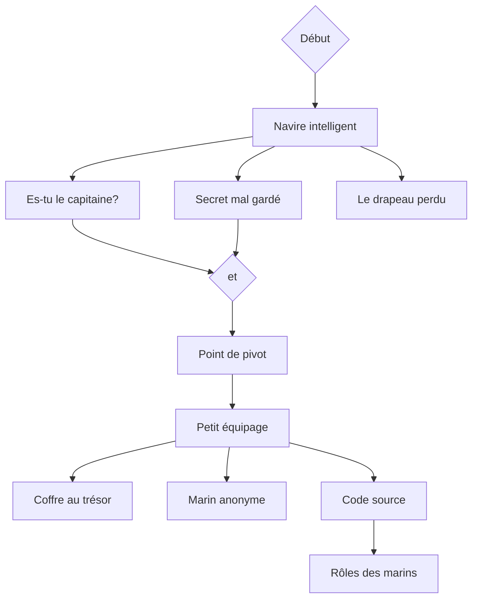

# Track Desjardins
Le diagramme indique l'ordre dans lequel les challenges devraient être débloqués. Ceux liés à `Début` devraient être disponible dès le début.

## Challenges
Voici les différents challenges de la track Desjardins.
  - [01. Navire intelligent](./descriptions/01.%20Un%20navire%20intelligent.md)
  - [02. Es-tu le capitaine?](./descriptions/02.%20Es-tu%20le%20capitaine.md)
  - [03. Secret mal gardé](./descriptions/03.%20Un%20secret%20mal%20gardé.md)
  - [04. Point de pivot](./descriptions/04.%20Point%20de%20pivot.md)
  - [05. Le drapeau perdu](./descriptions/05.%20Le%20drapeau%20perdu.md)
  - [06. Petit équipage](./descriptions/06.%20Petit%20équipage.md)
  - [07. Marin anonyme](./descriptions/07.%20Marin%20anonyme.md)
  - [08. Code source](./descriptions/08.%20Code%20source.md)
  - [09. Rôles des marins](./descriptions/09.%20Rôles%20des%20marins.md)
  - [10. Coffre au trésor](./descriptions/10.%20Coffre%20au%20trésor.md)
