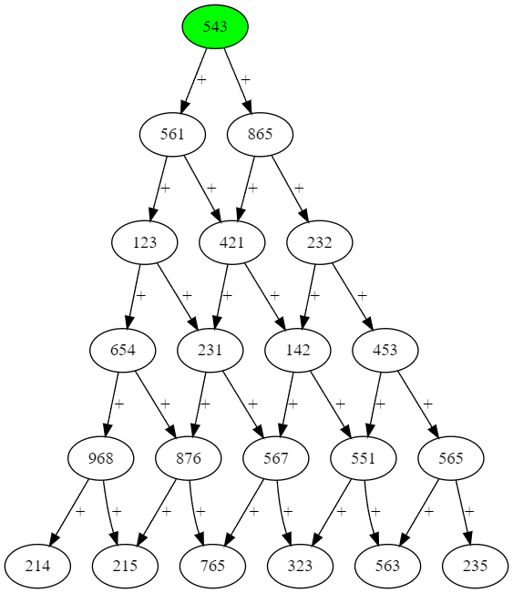

# Carte océanique 1

**`Auteur.e`** [Jersey591](https://github.com/Linden-Brochu)

## Description (français)

Arh ! Après avoir capturé un navire d'explorateur, vous découvrez la carte
océanique produite par l'un(e) des mathématicien(ne)s en exploration.
Malheureusement, l'auteur(e) a perdu connaissance en voyant votre navire.
Ses collègues ne peuvent déchiffrer la carte, toutefois iels savent que la carte
marque les emplacements de valeurs sous la forme d'un graphe.

**Format du flag**: `flag-{base64(valeur-max-en-parcourant-le-graphe)}`

Supposons un graphe de deux nœuds, A et B, avec un lien « + » de A vers B.
A ayant une valeur de 10 et B ayant une 5, la valeur maximale serait 15.

*Le graphe est représenté sous format texte sous le fichier `nodes.txt`
avec le premier nœud dans le fichier étant le nœud d'entrée.
La première ligne indique le nombre de nœuds.*

## Description (english)

Arh ! After capturing an exploration ship, you discovered an oceanic map
produce by one of the mathematician onboard. Unfortunately, the author
lost consciousness when he saw your ship. Their colleagues cannot decipher
the map, but they know that it represents the location of treasures
as a graph.

**Flag format**: `flag-{base64(max-value-while-traversing-the-graph)}`

Suppose a graph with two nodes, A and B, with a link "+" from A to B.
A has a value of 10 and B has a value of 5, the max value is 15.

*The graph is represented in text under the `nodes.txt` file with the first
node in the file being the entry node. The first line indicate the number of
nodes.*

## Solution

Solution of the challenge can be found [here](solution/).
