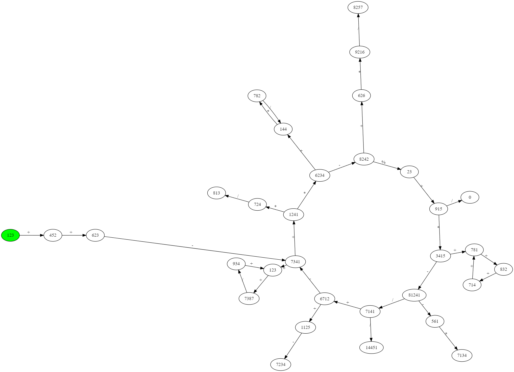
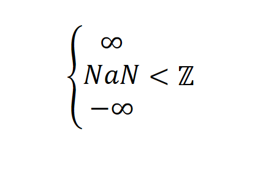

# Carte océanique 4

**`Auteur.e`** [Jersey591](https://github.com/Linden-Brochu)

## Description (français)

Après avoir franchi toutes les épreuves de l'expédition précédente,
votre navire se retrouve piégé dans un maelstrom. Sortez-en vivant
pour garder toute la richesse accumulée lors de votre voyage.

**Format du flag**: `flag-{base64(valeur-max-en-parcourant-le-graphe)}`

Supposons un graphe de deux nœuds, A et B, avec un lien « + » de A vers B.
A ayant une valeur de 10 et B ayant une 5, la valeur maximale serait 15.

*Le graphe est représenté sous format texte sous le fichier `nodes.txt`
avec le premier nœud dans le fichier étant le nœud d'entrée.
La première ligne indique le nombre de nœuds.*

**Toutes les opérations sont des opérations entières, donc pas de nombre
à virgule**

**Indice optionnel** (Même que le challenge d'avant)
Infini représente un overflow et `NaN` représente
une opération invalide telle une division par 0 (et ces valeurs sont plus
basses que le plus petit nombre entier).

## Description (english)

After beating each challenge of the expedition, your ship is trapped
in a maelstrom. Get out alive to keep all treasure found in your trip.

**Flag format**: `flag-{base64(max-value-while-traversing-the-graph)}`

Suppose a graph with two nodes, A and B, with a link "+" from A to B.
A has a value of 10 and B has a value of 5, the max value is 15.

*The graph is represented in text under the `nodes.txt` file with the first
node in the file being the entry node. The first line indicate the number of
nodes.*

**All operations give integer, so no floating point number**

**Optional hint** (Same as the precedent challenge)
Infinity represent an overflow and `NaN` represent
an invalid arithmetic operation such as a division by 0 (and those value are
lower than the lowest of integer).

## Solution

Solution of the challenge can be found [here](solution/).