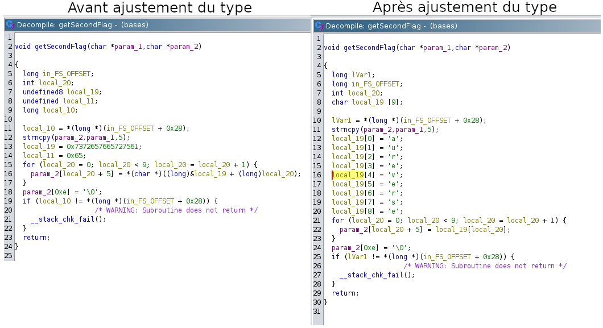
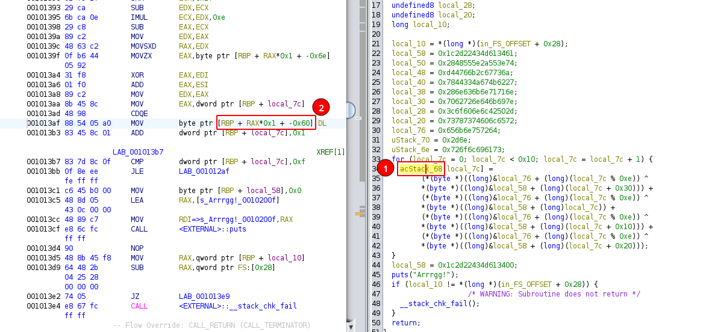

# Introduction au Reverse 1 (Les bases)

## Write-up

La première partie du flag est découverte avec `strings bases | grep flag` (sous Linux) qui permet d'extraire toutes les chaînes de caractère du programme et d'appliquer un filtre qui ne conserve que celles contenant "flag".

La deuxième partie s'obtient en ouvrant le programme dans Ghidra et en comprenant du programme qu'il copie la partie "flag-", puis il y ajoute "aureverse", ce qui donne "flag-aureverse"

Voici comment utiliser Ghidra:

1. Téléchargement et Installation :
    Rendez-vous sur le site officiel de Ghidra (https://ghidra-sre.org/).
    Téléchargez la dernière version disponible pour votre système d'exploitation.
    Installez Ghidra en suivant les instructions fournies.

2. Lancement de Ghidra :
    Ouvrez le dossier d'installation de Ghidra.
    Lancez l'exécutable approprié (par exemple, ghidraRun.bat pour Windows, ou ghidraRun pour Linux).

3. Création d'un Projet :
    À la première exécution, vous devrez créer un nouveau projet (File > New Project).
    Sélectionnez "Non-Shared Project" si vous travaillez seul.
    Choisissez un nom de projet et un emplacement pour stocker les données.

4. Démarrage du désassembleur
    Dans la barre d'outils (Tool Chest), choisissez le désassembleur (CodeBrowser) représenté par une tête de dragon verte (icône le plus à gauche).

5. Importation du Programme :
    Dans l'interface de Ghidra, cliquez sur "File" dans la barre de menus, puis sélectionnez "Import File".
    Choisissez le fichier exécutable ou binaire que vous souhaitez désassembler.

6. Analyse du Programme :
    Sélectionnez toutes les options d'analyse par défaut ("Yes", puis "Analyze" directement).
    Attendez que l'analyse soit terminée.

7. Ouverture du Programme Désassemblé :
    Dans la vue "Symbol Tree", sélectionnez Functions, puis "main" pour ouvrir le code de la fonction "main".

8. Exploration du Code Désassemblé :
    Vous verrez le code désassemblé dans l'interface Ghidra.
    Utilisez les différents panneaux et options pour naviguer dans le code, identifier les fonctions, les sauts, les appels de fonctions, etc.

Il est maintenant possible d'analyzer la fonction getSecondFlag. En lisant le code du décompilateur, présent dans la fenêtre de droite, on peut déterminer qu'on prend les caractères de local_19 (partie droite de l'opération) et qu'on les transfère dans param2 neuf fois. Il est donc possible d'assumer que local_19 est en fait un tableau de caractères de taille 9. Il est possible de changer le type de la variable en utilisant click-droit, puis "Retype Variable". En entrant ensuite "char [9]" on observe que la fonction est beaucoup plus facile à lire. On peut ainsi voir qu'à la fin de la fonction, param2 équivaut à "flag-aureverse". Il est pareillement possible de renommer les noms de variables en utilisant click-droit sur une variable, puis "Rename Variable".

Finalement la dernière partie du flag s'obtient en utilisant `gdb`, en s'arrêtant à l'instruction `puts`, puis en analysant le stack avec `telescope $rbp-0x60`. En effet, on remarque que l'analyse statique de la fonction computeThirdFlag n'est pas aussi triviale. En utilisant l'analyse dynamique, on laisse le programme faire le calcul pour nous et on récupère la valeur à la fin.

Concrètement, on commence pour ouvrir le programme avec gdb: `gdb bases`. Il est possible qu'il y a un problème avec GLIBC, dans ce cas, une machine virtuelle Kali Linux devrait régler le problème. Ce writeup assume que vous utilisez [GEF](https://github.com/hugsy/gef). Si ce n'est pas le cas, installez-le en suivant les instructions décrites sur la page Github du projet. On peut ensuite exécuter le programme avec l'instruction gdb `ni` ("step over") jusqu'à ce qu'on atteigne `call computeThirdFlag`. À ce point, exécuter `si` pour "step into" dans la fonction. Maintenant, retournons à Ghidra et déterminons le décallage (_offset_) de l'appel à "puts" dans la fonction. Cette appel se trouve après le calcul du flag, donc il est intéressant de s'y rendre pour ensuite pouvoir observer la valeur du flag sur le stack. Pour déterminer ce décallage, il suffit de soustraire l'adresse de la première instruction de la fonction à l'adresse de l'instruction `call puts`. Pour déterminer l'adresse d'une instruction, il suffit de cliquer sur l'instruction en question dans le décompilateur (fenêtre à droite), puis de récupérer l'adresse correspondante dans le désassembleur (fenêtre du centre-gauche). L'instruction sélectionnée est faiblement surlignée en bleu. Maintenant qu'on a le décalage (0x001013cf - 0x00101200 = 0x1cf), on peut l'ajouter à l'adresse de la première instruction de la fonction computeThirdFlag que l'on retrouve dans gdb. L'adresse dans gdb est différente de celle dans ghidra en raison d'une protection nommée [ASLR](https://en.wikipedia.org/wiki/Address_space_layout_randomization). Dans mon cas, l'adresse de la première instruction de computeThirdFlag dans gdb est 0x555555555200, donc l'adresse de l'instruction `call puts` dans gdb serait 0x555555555200 + 0x1cf = 0x5555555553cf. On peut donc entrer `b *0x5555555553cf` pour placer un breakpoint à cette instruction, puis exécuter le programme jusqu'à ce point d'arrêt avec `c`. Maintenant que le programme est de nouveau interrompu, on peut observer le stack à l'endroit où se trouve le flag. Mais où se trouve-t-il? Lorsqu'on sélectionne la variable de gauche dans l'opération de décryption du flag (la seule opération de la for-loop), on peut observer dans le code désassemblé (fenêtre au centre-gauche) que le résultat de l'opération est déplacé dans rbp - 0x60 (plus le compter), c'est donc à cet endroit que l'on doit regarder. L'image du bas représente cette opération visuellement. De retour dans gdb, on peut maintenant observer le stack à l'endroit précédemment mentionné avec `telescope $rbp-0x60` et découvrir que la chaîne de caractères qui se trouve à cet endroit est "flag-engineering"!

On peut ensuite concatener les réponses, comme décrit dans la description du défi, pour obtenir la réponse finale.

## Flag

`flag-introaureverseenginneering`