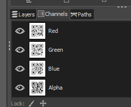
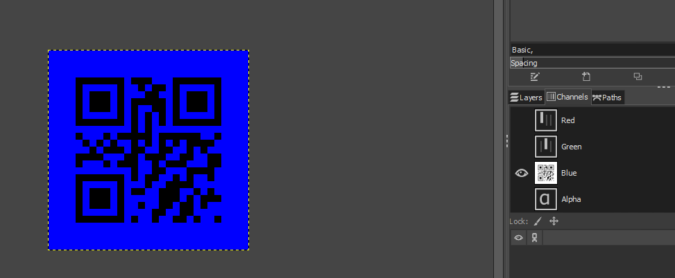

# Colorful Flags 1

## Write-up (français)

Il y a 3 code QR dans chaque code QR remis à l'étudiant. Un dans chaque channel de couleur.

Plusieurs logiciel peuvent être utiliser pour résoudre le problème. L'important est que l'étudiant sépart les différent cannaux de couleur de l'image pour lire chaque code QR. Ici avec Gimp, il est seulement nécessaire de charger l'image et d'aller dans l'onglet `channels` 

Par la suite il faut seulement laisser un canal de couleur apparaitre 'a la fois. Pour faire cela acliquer sur l'oeuil devant chaque canal non voulu, pour n'en l'aisser qu'un.

Pour trouver le flag finale, assembler tous les segment de texte des diff/rents cannaux dans le même ordre que celui des couleur lorsque prononcer (RGB) 

## Write-up (english)

There are 3 QR codes in each QR code given to the student. One in each color channel.

Several software can be used to resolve the problem. The important thing is that the student separates the different color channels of the image to read each QR code. Here with Gimp, it is only necessary to load the image and go to the `channels` tab

Afterwards you only need to let one color channel appear at a time. To do this, click on the eye in front of each unwanted channel, to leave only one.

To find the final flag, assemble all the text segments of the different channels in the same order as that of the colors when pronounced (RGB)

## Flag

`flag-Aye_Aye_m8ty_Steg_Is_th3_wond3r_of_the_sea`
