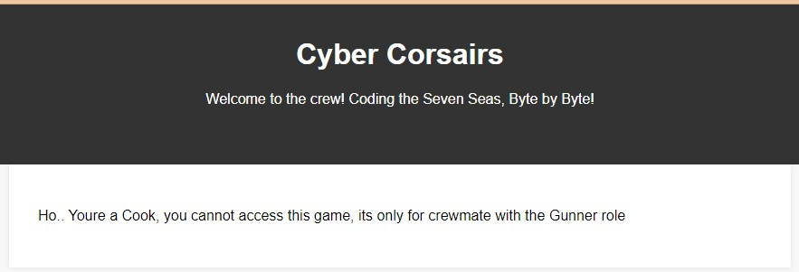
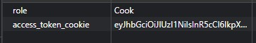
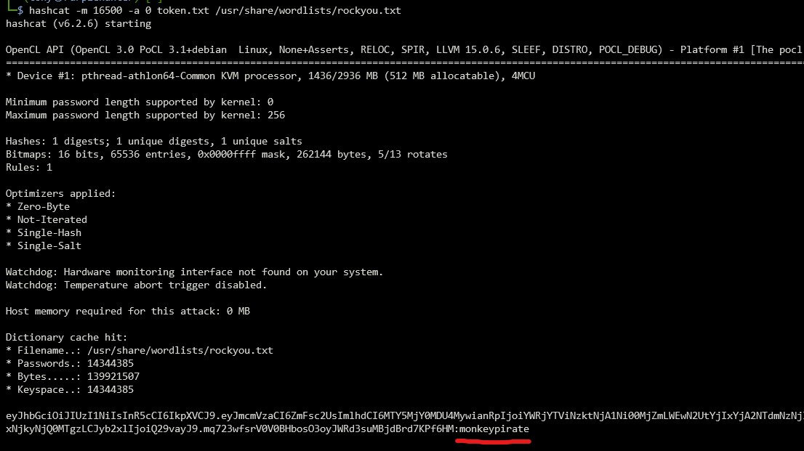
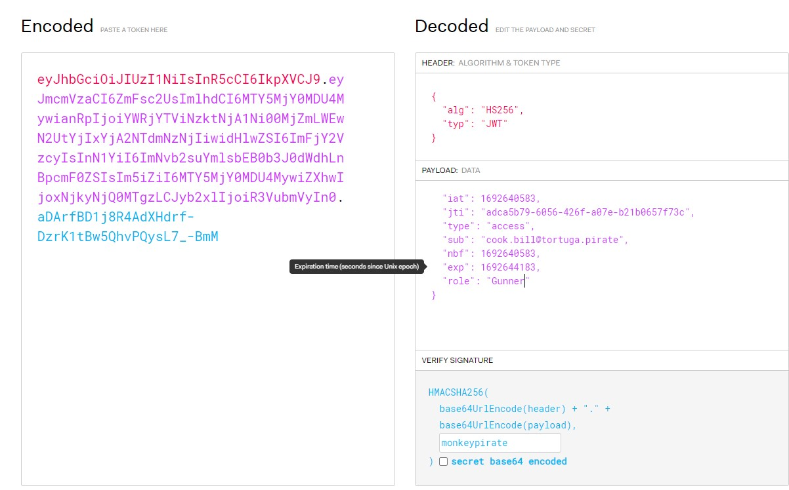

# Bill Ep 1 - New sailor in the ranks

# Write-up

## Francais

En te connectant au sur le site web, on te redirige vers la cale, cependant, celle-ci t'indique que tu n'as pas le rôle nécessaire pour y accéder.

Tu inspectes les cookie et tu y trouves un jeton d'authentification JWT. Seulement modifier le cookie rôle ou le rôle à l'intérieur du jeton JWT n'est pas suffisant, tu dois alors trouver la clef secrète. 

En utilisant hashcat et le dictionnaire rockyou.txt, tu trouves la clef `monkeypirate` (`hashcat -m 16500 -a 0 jwt.txt rockyou.txt`).

Une fois celle-ci trouvée, tu te rends sur jwt.io pour y forger un nouveau jeton et te voici en mesure d'accéder à la cale et obtenir le flag.

## English

By logging into the on the website, you are redirected to the hold, however, it tells you that you do not have the necessary role to access it.

You inspect the cookies and find a JWT authentication token. Just changing the cookie role or role inside the JWT token is not enough, so you have to find the secret key. 

Using hashcat and the rockyou.txt dictionary, you find the 'monkeypirate' key (`hashcat -m 16500 -a 0 jwt.txt rockyou.txt`).

Once found, you go to jwt.io to forge a new token and here you are able to access the hold and get the flag.

## Flag

`flag-TreasuresAreLikeBeersBetterShared`
