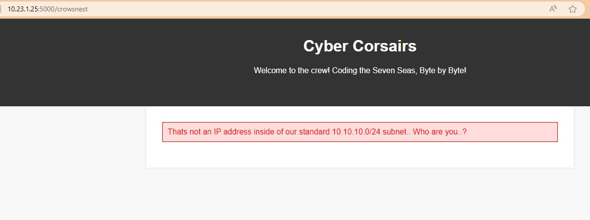
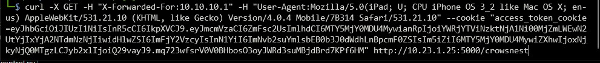

# Bill Ep 2 - A breathtaking view

# Write-up

## Francais

Le nid de pie n'est pas accessible à partir de n'importe quelle adresse IP, tu dois alors comprendre comment un site web obtient l'adresse d'un client, en particulier, si celui-ci est caché derrière un proxy. Une technique est de regarder l'en-tête `X-Forwarded-for: 10.10.10.1`. D'où le fait qu'il ne faut pas toujours se fier à cet en-tête pour obtenir l'adresse source.

Cependant, la montée de s'arrête pas là. Un message d'erreur t'informe que tu ne peux pas accéder à la page si tu n'utilises pas un iPad. Pour te faire passer pour un tel appareil, tu changes ton user-agent pour quelque chose comme : `Mozilla/5.0(iPad; U; CPU iPhone OS 3_2 like Mac OS X; en-us) AppleWebKit/531.21.10 (KHTML, like Gecko) Version/4.0.4 Mobile/7B314 Safari/531.21.10` et voilà, le flag s'étend devant tes yeux au côté d'une vue magnifique.

## English

The crow's nest is not accessible from any IP address, so you need to understand how a website gets a customer's address, especially if the client is hidden behind a proxy. One technique is to look at the header 'X-Forwarded-for: 10.10.10.1'. Hence the fact that you do not always have to rely on this header to get the source address.

However, the rise does not stop there. An error message informs you that you can't access the page if you're not using an iPad. To impersonate such a device, you change your user-agent to something like: 'Mozilla/5.0(iPad; U; CPU iPhone OS 3_2 like Mac OS X; en-us) AppleWebKit/531.21.10 (KHTML, like Gecko) Version/4.0.4 Mobile/7B314 Safari/531.21.10' And voilà, the flag extends before your eyes alongside a magnificent view.

## Flag

`flag-BringMeThatHorizonMate`