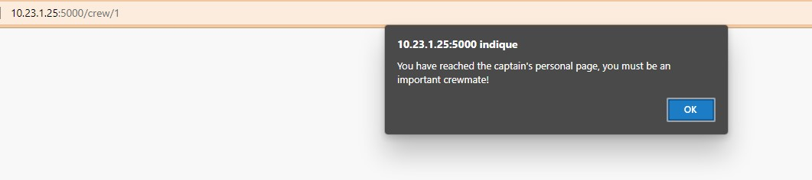
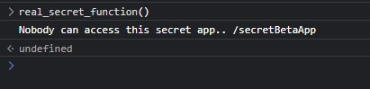
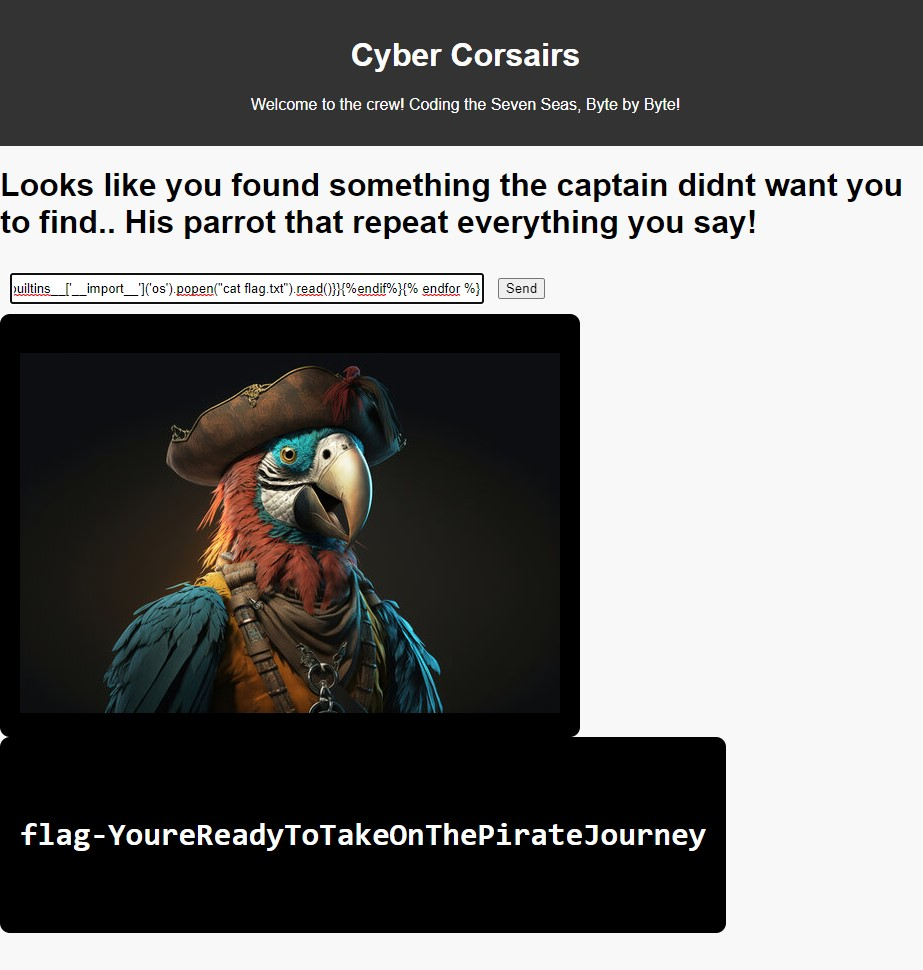

# Bill Ep 3 - The new pirate's last trial

# Write-up

## Francais

En naviguant au lien fourni, on voit 3 personnages qui semblent être des marins de l'équipage. En cliquant sur chacun des liens pour voir leur page personnelle, on remarque dans l'URL qu'ils ont respectivement des index de 2,3 et 4. On essaie alors de manipuler l'URL pour examiner qui a l'index 1 et on tombe sur la page du capitaine. Un pop-up nous laisse penser que le JavaScript de cette page est différent des autres.

En regardant le code source, nous remarquons une fonction JavaScript offusquée : `real_secret_function()`. En l'exécutant dans la console, nous obtenons le lien vers une page cachée du site : `/secretBetaApp`. 

En la visitant, on tombe sur un perroquet qui répète tout ce qu'on lui dit, nous essayons donc un polyglotte pour déterminer si cette page est vulnérable au SSTI : `${{<%[%'"}}%\.`, une erreur est levée, donc on sait qu'il s'agit d'une vulnérabilité SSTI. Par la suite, on essaie de déterminer le bon framework. On test {{7*'7'}}, ça marche, ce qui nous fait remarquer que c'est du Jinja2 et on se doute alors que le site est probablement en Flask ou en Django et on peut exécuter des commandes à l'aide du payload suivant qui peut être trouvé sur la page [hacktricks](https://book.hacktricks.xyz/pentesting-web/ssti-server-side-template-injection/jinja2-ssti).  des ssti Jinja2 (qui sert aussi à lire le fichier flag.txt) :  `{{x()._module.__builtins__['__import__']('os').popen("cat flag.txt").read()}}`

## English

Navigating to the link provided, we see 3 characters who appear to be sailors of the crew. By clicking on each of the links to see their personal page, we notice in the URL that they have indexes of 2.3 and 4 respectively. We then try to manipulate the url to examine who has index 1 and we come across the captain's page. A pop-up leads us to think that the javascript of this page is different from others. 

Looking at the source code, we notice a javascript function obfuscate: 'real_secret_function()'. By running it in the console, we get the link to a hidden page of the site: '/secretBetaApp'. 

While visiting it, we come across a parrot repeating everything we tell it, so we try a polyglot to determine if this page is vulnerable to SSTI: '${{<%[%'"}}%.', an error is thrown, so we know that it is an SSTI vulnerability. Then we try to determine the right framework. We test {{7*'7'}}, it works, which makes us notice that it is Jinja2 and we suspect that the site is probably in Flask or Django and we can execute commands using the following payload which can be found on the [hacktricks](https://book.hacktricks.xyz/pentesting-web/ssti-server-side-template-injection/jinja2-ssti) Jinja2 ssti page (which is also used to read the flag.txt file): '{{x()._module.__builtins__['__import__']('os').popen("cat flag.txt").read()}}'

## Flag

`flag-YoureReadyToTakeOnThePirateJourney`