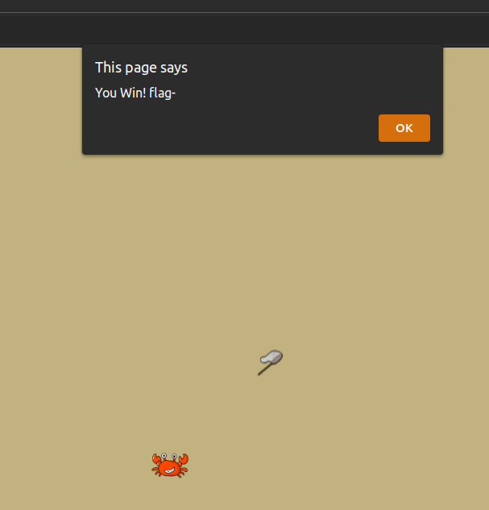
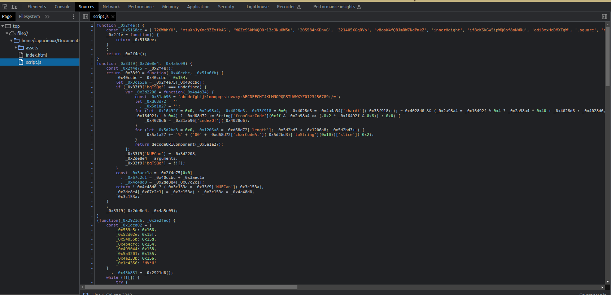
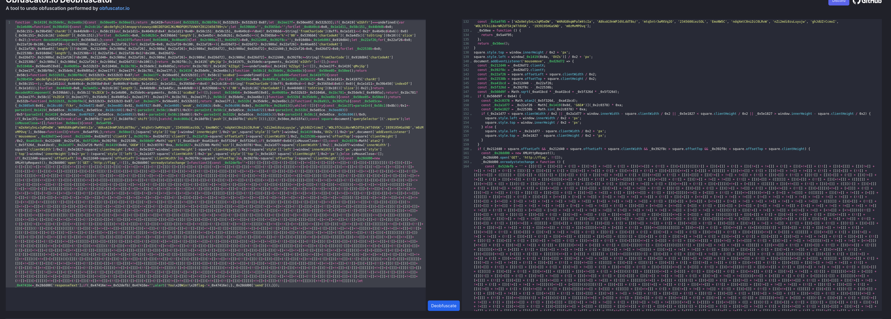
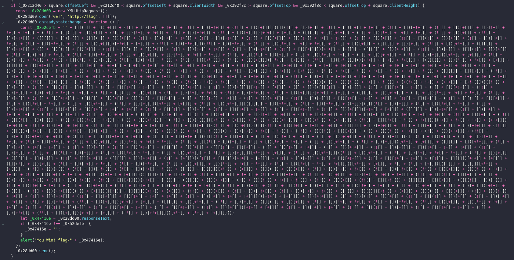
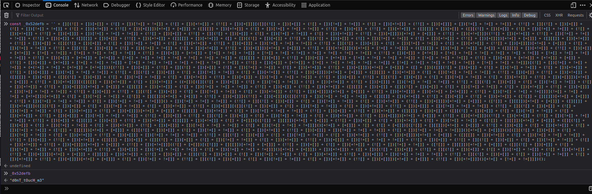

# Ctach me !

## Write-up (français)

Lorsque l'on arrive sur la page, l'objectif principal est de toucher le crabe avec le filet. Une fois cette action accomplie, une fenêtre d'alerte apparaît.

Il est apparent que les informations concernant le flag font défaut. Étant donné que `alert()` est un fragment de code JavaScript, nous pouvons examiner ce qui déclenche ce segment de code.

En inspectant le code JavaScript, on peut remarquer que ce dernier est obfusqué.

Nous pouvons alors soumettre le code à un outil en ligne pour voir le contenu une fois désobfusqué.

Site utilisé: https://obf-io.deobfuscate.io/ 

Lors de l'analyse du code, nous observons ce qui suit :

Ce code peut être interprété comme suit :
Si le carré (représenté ici par le crabe) touche le filet, une requête HTTP factice est effectuée.

Si le résultat de cette requête HTTP est identique à une string (dans la capture d'écran `_0x52defb`), la réponse est affichée dans l'alerte ; sinon, une chaîne de caractères vide est affichée.

Cela signifie que le contenu de la variable `_0x52defb` correspond au contenu du flag.

En réexaminant l'évaluation de la variable, nous pouvons récupérer la valeur.

## Write-up (anglais)

Upon arriving on the page, the primary goal is to touch the crab with the net. Once this is done, an alert window appears.

It can be observed that information about the flag is missing. Since `alert()`` is a piece of JavaScript code, one can investigate what triggers this piece of code.

When inspecting the JavaScript code, it becomes evident that it is obfuscated.

Therefore, it can be passed through an online tool to reveal the content once deobfuscated.

Used website: https://obf-io.deobfuscate.io/

Upon analyzing the code, the following is observed:

This code can be interpreted as follows:
If the square (represented here by the crab) touches the net, we send a dummy HTTP request.

If the result of this HTTP request is equal to a certain string (in the screenshot _0x52defb), we display the response in the alert; otherwise, we display an empty string.

This essentially means that the content of the variable _0x52defb is the flag's content.

By revisiting the evaluation of the variable, we can retrieve the value.

## Flag

`flag-d0nT_tOucH_m3`