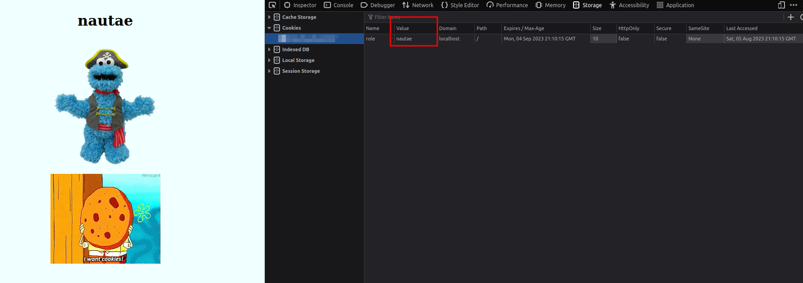

# Cookie monster

## Write-up (français)

Le nom du défi nous donne l'intuition que le défi portera sur les cookies du navigateur.

Lorsque l'on inspecte les cookies dans l'onglet "Storage" de l'inspecteur, on voit qu'un cookie est présent sur le site.

Comme indiqué dans le défi, Cookie Monster veut se faire passer pour un cuisinier. Si l'on change la valeur de role pour "cuisinier", on remarque que rien ne se produit.

Nous constatons que le rôle par défaut de Cookie Monster n'est pas "matelot" comme indiqué dans la description, mais nautae.

En utilisant Google Translate, nous observons que cela est en latin.

Ainsi, nous pouvons traduire "cuisinier" par coquere ou coquus. Lorsque nous insérons l'une de ces deux réponses en tant que valeur du cookie, un drapeau apparaît.

Par la suite, nous pouvons utiliser CyberChef pour décoder notre drapeau encodé en ROT13.

## Write-up (english)

The name of the challenge gives us the intuition that the challenge will be about browser cookies.

When inspecting cookies in the 'Storage' tab of the inspector, we see that a cookie is present on the website.

As stated in the challenge, Cookie Monster wants to impersonate a chef. If we change the value of role to 'chef', we notice that nothing happens.

We see that Cookie Monster's default role is not 'sailor' as mentioned in the description, but nautae.

Looking at Google Translate, we see that this is in Latin.

Therefore, we can translate 'chef' to coquere or coquus. By entering either of these two responses as the cookie value, a flag appears.

Subsequently, we can use CyberChef to find our flag encoded in ROT13.

## Flag

`flag-C0000oOokKKkki111iiie3ee3eee`